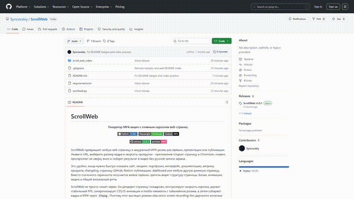

# ScrollWeb

<p align="center">
  <b>Генератор MP4-видео с плавным скроллом веб-страниц.</b>
</p>

<p align="center">
  
  
  
</p>

<p align="center">
  <a href="https://github.com/Syncovskiy/ScrollWeb/releases/tag/v1.0.1"></a>
  <a href="https://github.com/Syncovskiy/ScrollWeb/releases/download/v1.0.1/ScrollWeb.mp4"></a>
</p>

ScrollWeb превращает любую веб-страницу в аккуратный MP4-ролик для превью, презентации или публикации. Укажите URL, выберите размер кадра и скорость прокрутки - приложение откроет страницу в Chromium, плавно проскроллит ее сверху вниз и соберет результат в видео без ручной записи экрана.

Это удобно, когда нужно быстро показать сайт, лендинг, портфолио, интерфейс, документацию, витрину продукта, changelog, страницу GitHub, Notion-публикацию, dashboard или любую другую длинную страницу. Вместо статичного скриншота получается живое превью: зритель видит структуру страницы, блоки, анимации, медиа и общий визуальный ритм.

ScrollWeb не просто пишет экран. Он рендерит страницу покадрово, контролирует скорость скролла, держит стабильный FPS, синхронизирует CSS/JS-анимации и media-элементы с таймлайном ролика, а затем собирает кадры в MP4 через `ffmpeg`. Поэтому итог выглядит ровнее обычного screen recording: без дерганого колесика мыши, случайных движений курсора, уведомлений и плавающей скорости прокрутки.

## Видео

<p align="center">
  
</p>

## Для чего пригодится

- Сделать красивое MP4-превью сайта для README, Telegram, Discord, X/Twitter, YouTube Shorts или портфолио.
- Показать длинный лендинг клиенту без отправки десятков скриншотов.
- Снять демонстрацию UI, панели администратора, dashboard или SaaS-страницы.
- Подготовить видео об обновлении продукта, changelog или новой странице документации.
- Превратить страницу GitHub, документацию или публичный Notion-like материал в короткий обзорный ролик.
- Быстро получить одинаковые превью для нескольких сайтов с одинаковыми параметрами через CLI.

## Что получается на выходе

- MP4-файл, который легко отправить, встроить в пост или приложить к релизу.
- Плавный вертикальный scroll-capture с контролируемой скоростью.
- Чистый кадр без курсора, интерфейса браузера и лишних окон.
- Предсказуемый размер, FPS и качество H.264.
- Повторяемый результат: один и тот же URL можно рендерить с одинаковыми настройками.

## Возможности

- GUI на Tkinter для быстрого рендера без командной строки.
- CLI для автоматизации и batch-сценариев.
- Настройка размера viewport, FPS, скорости, длительности и easing.
- Предзагрузка lazy-контента перед записью.
- Синхронизация CSS-анимаций, JS-таймеров, `video` и `audio`, включая iframe.
- Автоматический fallback на `imageio-ffmpeg`, если системный `ffmpeg` не найден.

## Установка

Требования:

- Python 3.10 или новее
- Chromium browser для Playwright
- `ffmpeg` в `PATH` или `imageio-ffmpeg` из `requirements.txt`

```powershell
python -m pip install -r requirements.txt
python -m playwright install chromium
```

## GUI

```powershell
python .\scrollweb.py
```

В окне приложения укажите URL, путь к MP4, параметры видео и нажмите `Create MP4`.

## CLI

Базовый рендер:

```powershell
python .\scrollweb.py https://example.com -o example.mp4
```

Размер, FPS и скорость:

```powershell
python .\scrollweb.py https://example.com -o example.mp4 --width 1920 --height 1080 --fps 30 --speed 900
```

Точная длительность скролла вместо расчета по скорости:

```powershell
python .\scrollweb.py https://example.com -o example.mp4 --duration 12
```

Дополнительное ожидание после загрузки страницы:

```powershell
python .\scrollweb.py https://example.com -o example.mp4 --wait-after-load 5
```

Линейная прокрутка без easing:

```powershell
python .\scrollweb.py https://example.com -o example.mp4 --easing linear
```

Отключить синхронизацию анимаций и media:

```powershell
python .\scrollweb.py https://example.com -o example.mp4 --no-sync-animations
```

## Параметры

| Опция | Назначение |
| --- | --- |
| `-o`, `--output` | Путь к итоговому MP4 |
| `--width`, `--height` | Размер viewport |
| `--fps` | Частота кадров видео |
| `--speed` | Средняя скорость прокрутки в CSS px/s |
| `--duration` | Фиксированная длительность прокрутки |
| `--wait-after-load` | Пауза после загрузки страницы |
| `--easing` | `smoothstep` или `linear` |
| `--no-preload` | Не делать предварительный проход для lazy-контента |
| `--crf` | Качество H.264, от `0` до `51` |
| `--no-sync-animations` | Не синхронизировать таймлайн страницы с видео |

## Release

Готовые версии публикуются в GitHub Releases. В релиз прикладывается чистый архив проекта без `__pycache__`, виртуальных окружений и сгенерированных MP4.
